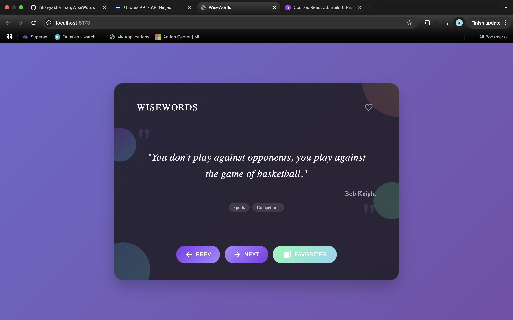

# WordWise - A Quote Generator App



## Overview

WordWise is a modern, elegant quote generator application that displays inspirational quotes from famous authors and thinkers. The app features a beautiful UI with animated elements and allows users to browse through quotes, mark favorites, and view their collection of saved quotes.

## Features

- **Random Quotes**: Fetch and display random quotes from the Quotable API
- **Navigation**: Browse through quotes with previous and next buttons
- **Favorites**: Save up to 5 of your favorite quotes for quick access
- **Tags**: View categories/tags associated with each quote
- **Responsive Design**: Beautiful UI that works on all device sizes
- **Offline Support**: Fallback quotes available when API is unavailable

## Technologies Used

- React.js
- CSS3 with animations
- Quotable API for fetching quotes
- Fisher-Yates algorithm for quote randomization

## How to Use

1. **Browse Quotes**: Use the "NEXT" and "PREV" buttons to navigate through quotes
2. **Save Favorites**: Click the heart icon to save a quote to your favorites (limit: 5)
3. **View Favorites**: Click the "FAVORITES" button to see your saved quotes
4. **Refresh**: If you want completely new quotes, refresh the page

## API Integration

WordWise uses the [Quotable API](https://github.com/lukePeavey/quotable) to fetch random quotes. The app makes HTTP requests to the API endpoint and displays the returned quotes in a beautiful card format.

## Installation and Setup

1. Clone the repository:
   ```
   git clone https://github.com/bhavyasharma5/WordWise.git
   ```

2. Navigate to the project directory:
   ```
   cd WordWise
   ```

3. Install dependencies:
   ```
   npm install
   ```

4. Start the development server:
   ```
   npm start
   ```

5. Open your browser and navigate to `http://localhost:3000`

## Future Enhancements

- Search functionality to find quotes by keyword
- Filter quotes by author or tag
- Dark/light theme toggle
- User accounts to save favorites across devices

## Credits

- Quotes provided by [Quotable API](https://github.com/lukePeavey/quotable)
- Created by Bhavya Sharma

